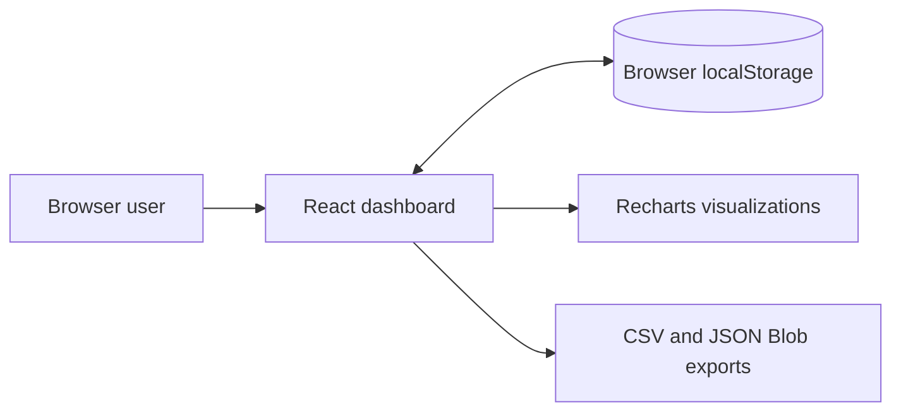

# Ledgerly

> A private browser-based expense tracker for reading everyday spending clearly.

[](https://github.com/vincenzo-afk/Ledgerly/actions/workflows/ci.yml)
[](./LICENSE)

[Repository](https://github.com/vincenzo-afk/Ledgerly) · [Report a bug](https://github.com/vincenzo-afk/Ledgerly/issues/new?template=bug_report.yml) · [Request a feature](https://github.com/vincenzo-afk/Ledgerly/issues/new?template=feature_request.yml)

Ledgerly is a static personal-finance web application for recording expenses, tracking a monthly budget, and exploring spending patterns without creating an account. The app stores records in the current browser and generates CSV or JSON exports directly on the device.

## Table of contents

- [About](#about)
- [Features](#features)
- [Architecture](#architecture)
- [Technology](#technology)
- [Getting started](#getting-started)
- [Using Ledgerly](#using-ledgerly)
- [Data and privacy](#data-and-privacy)
- [Project structure](#project-structure)
- [Quality checks](#quality-checks)
- [Deployment](#deployment)
- [Contributing](#contributing)
- [Security](#security)
- [License](#license)
- [Acknowledgments](#acknowledgments)

---

## About

Ledgerly provides a focused local ledger for personal expense records. It combines transaction management with a dashboard for totals, spending-by-category, the most recent seven-day rhythm, and a six-month spending view. It is intentionally frontend-only: there is no account system, bank connection, backend API, or database.

## Features

| Area            | Available capability                                                                                           |
| --------------- | -------------------------------------------------------------------------------------------------------------- |
| Expense records | Add, edit, and delete an expense with an amount, category, date, and optional note.                            |
| Budget view     | Set an optional monthly budget and see the current filtered spend, remaining balance, or budget-reached state. |
| Dashboard       | View total spend, transaction count, largest expense, and average spend per recorded day.                      |
| Charts          | Review a seven-day spending rhythm, category composition, and a six-month monthly-spend view.                  |
| Filters         | Search notes and categories, then filter records by current month, last month, all time, or category.          |
| Exports         | Download the full local ledger as `ledgerly-expenses.csv` or `ledgerly-expenses.json`.                         |
| Privacy         | Keep expense records and the budget in the browser through `localStorage`.                                     |
| Search metadata | Ship an SEO-aware document shell with structured application data, `robots.txt`, and `sitemap.xml`.            |

## Architecture



## Technology

| Layer                       | Technology                                            |
| --------------------------- | ----------------------------------------------------- |
| User interface              | React 19, TypeScript, Tailwind CSS, custom CSS tokens |
| Build and local development | Vite 7, pnpm                                          |
| Visualizations              | Recharts 2                                            |
| Icons and feedback          | Lucide React, Sonner                                  |
| Production server           | Express bundle created by the project build script    |
| Storage                     | Browser `localStorage` only                           |

---

## Getting started

### Prerequisites

- Node.js 22, matching the continuous-integration environment.
- pnpm 10.

### Install and run

```bash
git clone https://github.com/vincenzo-afk/Ledgerly.git
cd Ledgerly
pnpm install
pnpm dev
```

Vite prints the development URL after the server starts.

### Configuration

Ledgerly does not require an app-specific API key, account, database connection, or local environment file to run its expense-tracking features. The application works with browser-local data.

## Using Ledgerly

1. Use **Record an expense** to enter a positive amount, category, date, and optional note.
2. Set an optional **Monthly budget** from the sidebar.
3. Use the transaction search and filters to focus the current view.
4. Select the edit or delete action in a transaction row to maintain a record.
5. Use **Export CSV** or **Export JSON** to save the complete local ledger outside the browser.

Exports include the date, category, amount, and note fields for every stored expense. The dashboard charts update from the records visible in the app.

## Data and privacy

Ledgerly stores data under the following browser-local keys:

| Key                     | Stored value                                     |
| ----------------------- | ------------------------------------------------ |
| `paper-signal-expenses` | The local array of user-created expense records. |
| `paper-signal-budget`   | The optional budget amount.                      |

The data is tied to the current browser profile and device. Clearing browser storage, using a different browser, or using a private window can remove access to those records. Export data periodically if a separate backup is required.

Ledgerly is not a bank integration, accounting system, financial adviser, or emergency record system.

## Project structure

```text
.
├── client/
│   ├── public/
│   │   ├── robots.txt              # Crawler directives
│   │   └── sitemap.xml             # Single-page sitemap
│   ├── src/
│   │   ├── pages/Home.tsx          # Dashboard, records, filters, and exports
│   │   ├── index.css               # Paper & Signal visual system
│   │   └── App.tsx                 # Application shell and routing
│   └── index.html                  # Metadata and structured application data
├── server/index.ts                 # Static production server
├── .github/workflows/ci.yml        # TypeScript and build validation
├── package.json                    # Scripts and dependencies
└── README.md
```

## Quality checks

Run the same checks used by the repository workflow before opening a pull request:

```bash
pnpm run check
pnpm run build
```

`pnpm run check` runs the TypeScript compiler without emitting files. `pnpm run build` creates the Vite client build and bundles the production Express server. The repository does not currently contain a separate automated test suite.

## Deployment

Create a production build with:

```bash
pnpm run build
pnpm run start
```

The build command outputs the compiled application to `dist/`. Before publishing on a custom domain, update the canonical URL, Open Graph URL, structured data URL, `robots.txt`, and `sitemap.xml` together so search metadata reflects the actual public address.

## Contributing

Contributions are welcome through GitHub issues and pull requests.

1. Create a branch using a focused name such as `feature/csv-import` or `fix/export-encoding`.
2. Make the smallest relevant change and keep the interface responsive.
3. Run `pnpm run check` and `pnpm run build`.
4. Open a pull request using the provided template, describing the change and validation performed.

See [CONTRIBUTING.md](./CONTRIBUTING.md) for the detailed contribution workflow.

## Security

Please do not disclose a security concern in a public issue. See [SECURITY.md](./SECURITY.md) for the reporting process and project scope.

## License

Ledgerly is licensed under the [MIT License](./LICENSE). Copyright © 2026 BHARANI KUMAR S.

## Acknowledgments

Ledgerly uses [React](https://react.dev/), [Vite](https://vite.dev/), [Recharts](https://recharts.org/), [Lucide](https://lucide.dev/), and [Tailwind CSS](https://tailwindcss.com/).

---

<p align="center"><a href="#ledgerly">Back to top</a> · <a href="https://github.com/vincenzo-afk/Ledgerly">View the repository</a></p>
